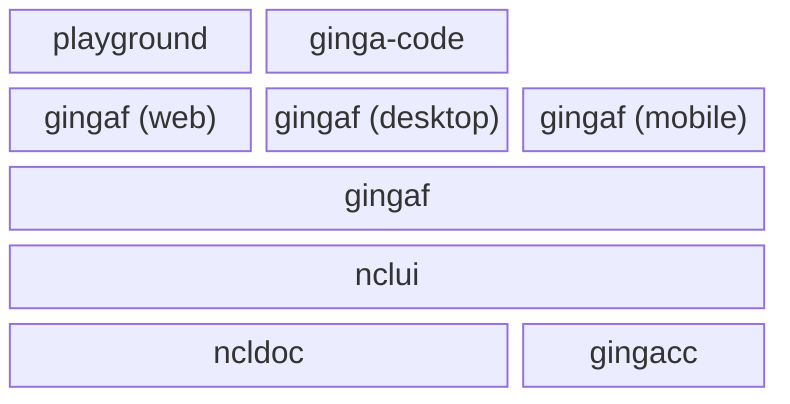

# gingaf

[](./LICENSE)

`gingaf` is an MIT-licensed, multi-platform implementation of the interactive TV middleware Ginga standardised by ITU-T and SBTVD.

## Architecture

The `gingaf` repository is organized as a monorepo: the root directory contains the Flutter host application. It depends on core Dart packages in  `packages/gingacc/` (the common configuration, users, and CCWS library, see [packages/gingacc/README.md](packages/gingacc/README.md)), `packages/ncldoc/` (the headless execution engine, see [packages/ncldoc/README.md](packages/ncldoc/README.md)), and `packages/nclui/` (the visual execution engine, see [packages/nclui/README.md](packages/nclui/README.md)). While [`node/`](node/README.md) contains web interactive playground and npm package.



## Developing Ginga Applciations

You can use `gingaf` to develop Ginga applications:
- at web by using the playground or acessing [ginga.org.br/gingaf/playground](ginga.org.br/gingaf/playground).
- at desktop by the Visual Studeio code extension [ginga-code](https://github.com/ginga-org-br/ginga-code).

## Demonstration Videos

### Windows

https://github.com/user-attachments/assets/07c9fb0f-a9f1-406b-b650-fa4eee331af0

### Android

https://github.com/user-attachments/assets/5bbecb80-04c7-4574-88d5-e979d1c11e22

### Chrome

https://github.com/user-attachments/assets/b04eabac-4636-453c-beec-7ec845d841a4

### NCL headless

https://github.com/user-attachments/assets/576cba53-04b7-4b55-b4a5-97d1b78f4a79

### Playground Ginga-NCL (video.ncl)

https://github.com/user-attachments/assets/c6fd4ce3-66a5-4888-8b49-50dde510c2d8

### Playground  Ginga-HTML5 (current_service.html)

https://github.com/user-attachments/assets/3f4aa3f4-5950-4b6e-8a32-50021e8b014f

### Playground  Ginga-NCL with Lua (lua.ncl)

https://github.com/user-attachments/assets/b06bf145-4cc2-4431-9f00-98b218cfedde

### Launch Ginga Application from VSCode

https://github.com/user-attachments/assets/717948df-64ab-42c9-8dd6-3a4a2e3603da

## gingaf (desktop) run applications from local `examples/`

All example NCL and HTML documents are stored in the `examples/` folder. You can configure and run the application via APP environment variable (e.g. `examples/image.ncl` or `examples/image.html`).

```bash
flutter run -d windows --dart-define="APP=examples/video.ncl"
flutter run -d windows --dart-define="APP=examples/image.html"
```

For convenience, you can use `make run-example` for the current platform:

```bash
make run-example app=video.ncl
make run-example app=image.html
```

## gingaf (web, mobile) run applications from URLs

```bash
flutter run -d chrome --dart-define="APP=https://raw.githubusercontent.com/ginga-org-br/gingaf/refs/heads/main/examples/video.ncl"
```
