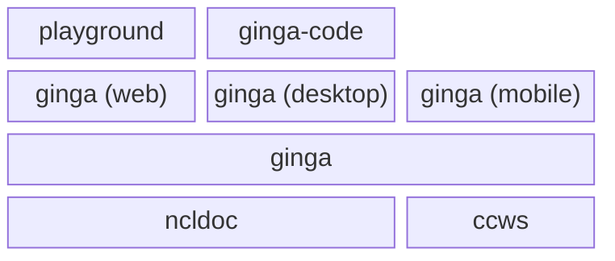

# gingaf

[](./LICENSE)

`gingaf` is an MIT-licensed, multi-platform implementation of the interactive TV middleware Ginga standardised by ITU-T and SBTVD.

For a web-based evaluation of `gingaf`, see [a github-hosted Ginga Playground](https://ginga-org-br.github.io/gingaf/playground/).

The `gingaf` project structure is:



- `packages/ncldoc/` - Dart-based headless execution engine and core NCL library. See [packages/ncldoc/README.md](packages/ncldoc/README.md).
- `packages/ccws/` - Dart-based Ginga-CC-WebService library. See [packages/ccws/README.md](packages/ccws/README.md).
- `ginga/` - Ginga visual of Ginga-NCL and Ginga-HTML5 applications (contains the `examples/` for testing). See how to run application at [ginga/README.md](ginga/README.md). Depends on `packages/ncldoc/` and `packages/ccws/`.
- `ginga-node/` - Web-based interactive playground for evaluating gingaf. See [ginga-node/README.md](ginga-node/README.md). Uses `ginga (web)`.
- `ginga-code/` - Visual Studio Code extension. See [ginga-code/README.md](ginga-code/README.md). Uses `ginga (desktop)`.

## Demonstration Videos

### Windows

https://github.com/user-attachments/assets/07c9fb0f-a9f1-406b-b650-fa4eee331af0

### Android

https://github.com/user-attachments/assets/5bbecb80-04c7-4574-88d5-e979d1c11e22

### Chrome

https://github.com/user-attachments/assets/b04eabac-4636-453c-beec-7ec845d841a4

### NCL headless

https://github.com/user-attachments/assets/576cba53-04b7-4b55-b4a5-97d1b78f4a79

### Playground Ginga-NCL (video.ncl)

https://github.com/user-attachments/assets/c6fd4ce3-66a5-4888-8b49-50dde510c2d8

### Playground  Ginga-HTML5 (current_service.html)

https://github.com/user-attachments/assets/3f4aa3f4-5950-4b6e-8a32-50021e8b014f

### Playground  Ginga-NCL with Lua (lua.ncl)

https://github.com/user-attachments/assets/b06bf145-4cc2-4431-9f00-98b218cfedde

### Launch Ginga Application from VSCode

https://github.com/user-attachments/assets/717948df-64ab-42c9-8dd6-3a4a2e3603da

## Run Ginga-NCL or Ginga-HTML applications with UI

All example NCL and HTML documents are stored in the `examples/` folder. You can configure and run the application via APP environment variable (e.g. `examples/image.ncl` or `examples/image.html`).

```bash
flutter run -d windows --dart-define="APP=examples/image.ncl"
flutter run -d windows --dart-define="APP=examples/video.ncl"
```

For convenience, you can use `make run-example` for the current platform:

```bash
make run-example app=viode.ncl
make run-example app=image.html
make run-example app=primeiro-joao/00syncProp.ncl
```
