# gingaf

`gingaf` is an MIT-licensed, multi-platform implementation of the interactive TV middleware Ginga standardised by ITU-T and SBTVD.

## Architecture

The `gingaf` documentation is available at [https://ginga-org-br.github.io/gingaf/docs](https://ginga-org-br.github.io/gingaf/docs). The repository is organized as a monorepo: the root directory contains the Flutter host application. See the main components below.

- `packages/gingacc/`: configuration, users, and CCWS
- `packages/ncldoc/`: NCL headless execution engine
- `packages/nclui/`: NCL and visual widgets
- `node/`: npm package which also contains web interactive playground

## Developing Ginga Applications using `gingaf`

You can use `gingaf` to develop Ginga applications at web by using the playground or acessing [ginga.org.br/gingaf/playground](https://ginga.org.br/gingaf/playground), or at desktop by the Visual Studio Code extension [ginga-code](https://github.com/ginga-org-br/ginga-code).

See demonstration videos below.

**Windows**

https://github.com/user-attachments/assets/07c9fb0f-a9f1-406b-b650-fa4eee331af0

**Android**

https://github.com/user-attachments/assets/5bbecb80-04c7-4574-88d5-e979d1c11e22

**Chrome**

https://github.com/user-attachments/assets/b04eabac-4636-453c-beec-7ec845d841a4

**NCL headless**

https://github.com/user-attachments/assets/576cba53-04b7-4b55-b4a5-97d1b78f4a79

**Playground Ginga-NCL (video.ncl)**

https://github.com/user-attachments/assets/c6fd4ce3-66a5-4888-8b49-50dde510c2d8

**Playground  Ginga-HTML5 (current_service.html)**

https://github.com/user-attachments/assets/3f4aa3f4-5950-4b6e-8a32-50021e8b014f

**Playground  Ginga-NCL with Lua (lua.ncl)**

https://github.com/user-attachments/assets/b06bf145-4cc2-4431-9f00-98b218cfedde

**Launch Ginga Application from VSCode**

https://github.com/user-attachments/assets/717948df-64ab-42c9-8dd6-3a4a2e3603da
